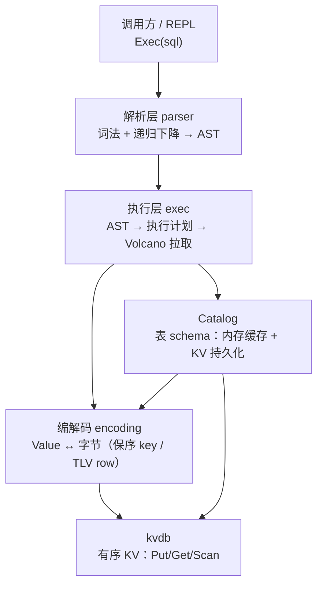

# sqldb 设计方案 —— 在 LSM-Tree KV 引擎上实现 SQL 核心功能

> 状态：设计评审稿（2026-09-23）。代码尚未开始写（types / encoding 有草稿，与本文一致）。
> 目的：学习"SQL 层怎么长在 KV 存储上"。不是造可用数据库，也不做分布式/事务。

---

## 1. 目标与范围

**一句话**：把 `github.com/xiatianliang1024gm/kvdb`（单机 LSM-Tree KV 引擎）当作唯一存储原语，
在其上实现一个嵌入式 SQL 引擎 `sqldb`，覆盖 SQL 的核心子集。

### 范围内（In Scope）

| 能力 | 说明 |
|---|---|
| DDL | `CREATE TABLE` / `DROP TABLE`（含 IF [NOT] EXISTS） |
| DML | `INSERT`（多行）、`UPDATE`、`DELETE` |
| 查询 | `SELECT`：投影、别名、`WHERE`、`ORDER BY`、`LIMIT/OFFSET`、`DISTINCT` |
| 聚合 | `COUNT(*)`、`COUNT(col)`、`SUM/AVG/MIN/MAX` + `GROUP BY` + `HAVING` |
| 连接 | `INNER JOIN ... ON`（嵌套循环实现） |
| 表达式 | 比较、四则运算、`AND/OR/NOT`、`IS [NOT] NULL`、`IN`、`BETWEEN`、`LIKE` |
| 类型 | `INT / FLOAT / TEXT / BOOL` + `NULL`，`NOT NULL` 约束，主键约束 |
| 主键 | 单列主键（INT/FLOAT/TEXT/BOOL）；无主键表自动补隐藏 `rowid` |

### 范围外（Out of Scope，写死边界）

- **事务与隔离级别**：单条语句原子（靠 kvdb 的 WriteBatch），语句之间没有一致性快照。
- **多表外键、CHECK 约束**。
- **二级索引**：只有主键一个有序入口。这是刻意的——二级索引是"SQL on KV"的第二课，
  第一课先把主键路径走通。
- **LEFT/RIGHT JOIN、子查询、视图、窗口函数、CTE**。
- **并发 DDL**：catalog 有锁但按"单写者、多读者"假设设计。
- **文本编码校验、字符集排序规则（collation）**：TEXT 一律按字节序。

### 对 kvdb 的依赖面（调用方承诺）

只依赖 kvdb 的这五个原语，多一个都不用：

1. `Put / Delete / Write(batch)` —— 写入，batch 原子生效；
2. `Get` —— 主键点查（`ErrNotFound` 语义）；
3. `NewIterator` —— 有序范围扫描（半开区间 `[Lower, Upper)`、前缀扫描）；
4. `GetSnapshot` —— 暂不使用（事务的入口之一，留到以后）；
5. `Open / Close`。

**判断标准**：如果某个功能必须绕过这五个原语才能实现，说明设计错了层次。

---

## 2. 总体架构

四层，自上而下单向依赖。每一层对上层只暴露一个入口函数：



- **parser**：不认识 catalog，不认识存储。产出的 AST 是纯语法结构。
- **exec**：把 AST 绑定到 catalog（名字 → 列偏移），生成计划树，Volcano 迭代器逐行拉取。
- **encoding**：唯一知道"字节怎么摆"的层。执行器和 catalog 都不碰编码细节。
- **catalog**：唯一知道"有哪些表"的层，持久化进 KV 的 meta 前缀。

这个分层对应的检验问题：**能不能不看其他层的代码就给某一层写单测？**
parser 可以（AST 断言）、encoding 可以（字节断言）、exec 勉强可以（需要 catalog 桩）、
顶层只能端到端。测试计划按这个边界组织。

---

## 3. 键空间布局：一个 KV 里装下整个数据库

数据库 = 一个 kvdb 目录。全部数据（元数据 + 表数据）共享一个键空间，用前缀分三个区域：

```
键空间
├── meta 区      "m" | ...        表 schema、ID 分配计数器、rowid 计数器
└── data 区      "d" | ...        表行数据
```

具体键格式：

| 内容 | 键 | 值 |
|---|---|---|
| 表 schema | `m` `\x00` `schema:` `<表名>` | JSON（表ID、列定义、主键位） |
| 下一个表 ID | `m` `\x00` `nextid` | 8 字节大端 uint64 |
| 表 rowid 计数器 | `m` `\x00` `rowseq:` `<表ID>` | 8 字节大端 uint64 |
| 一行数据 | `d` `\x00` `<表ID 8B 大端>` `r` `<保序主键编码>` | TLV 行编码 |

**为什么用 `\x00` 做区分隔符、用定长表 ID 而不是表名做前缀**：

- 表名长度可变，`dtab1` 和 `dtab10` 会前缀撞车；8 字节定长 ID 没有这个问题。
- ID 从 `nextid` 单调分配，Catalog 负责名字 ↔ ID 映射。
- 删表即删区间：`DROP TABLE` 用 kvdb 的范围扫描逐键删 `[d\x00<表ID>... 前缀全区间)`。

**data 键的结构拆开看**：

```
d  \x00  [tableID: 8B]  r  [PK保序编码]
└区┘└──┘└────固定头────┘└标记┘└─────行定位─────┘
```

- 一张表的所有行落在一个连续的键区间里，前缀 `d\x00<tableID>r`；
- 区间内按**主键的 SQL 值序**排列（这是保序编码的功劳，见 §4）；
- `r` 这个单字节标记是给将来留的：二级索引可以放 `d\x00<tableID>i...`，
  互不干扰（本版不实现，只预留命名空间）。

**如果反过来会怎样**：把表名放前缀里——表重命名就要改写全部行的键；
把行数据哈希打散而不是按主键排——范围查询 `WHERE id > 10` 就退化成全表捞回内存过滤。

---

## 4. 保序编码（整个设计里最重要的一节）

### 4.1 问题

SQL 语义要"按值序"，KV 只给"按字节序"。两者必须手工对齐，靠的就是主键的保序编码：

> 对任意两个非 NULL 主键值 a、b：`bytes(encode(a)) < bytes(encode(b))` 当且仅当 `a < b`（SQL 语义）。

三条铁律：**保序、可逆、前缀无歧义**（任意两个不同值的编码互不为前缀）。
前缀无歧义是范围扫描的正确性前提——如果 `encode("ab")` 是 `encode("abc")` 的前缀，
seek 到 `ab` 时扫描可能误入下一行。

### 4.2 方案：标签字节 + 类型变换

每个主键编码 = 1 字节类型标签 + 类型特定载荷：

| 类型 | 标签 | 载荷 | 保序手段 |
|---|---|---|---|
| NULL | `0x00` | （空） | ——（主键禁 NULL，此标签仅防御） |
| INT | `0x01` | 8B | 大端 + **符号位翻转**：`uint64(v) ^ (1<<63)`，负数补码高位变 0，落到正数前面 |
| FLOAT | `0x02` | 8B | IEEE754 位模式修正：负数按位取反、非负数翻符号位；顺带解决 `-0.0`/`0.0` 位模式不同值相同的问题 |
| TEXT | `0x03` | 字节串 + `0x00 0x00` 结尾 | **0x00 转义**：内容中的 `0x00` 写作 `0x00 0xFF`；结尾 `0x00 0x00` 严格大于任何转义序列 |
| BOOL | `0x04` | 1B（`0x00`/`0x01`） | 平凡 |

- 标签字节本身有序（`0x00 < 0x01 < ...`），跨类型排序有确定结果，尽管 SQL 不允许跨族比较。
- TEXT 不允许直接接载荷——内容里可能有 `0x00`，与"下一个字段的标签"产生歧义，
  转义方案同时解决保序和前缀无歧义。

**为什么不用现成方案**（RocksDB 的 user-key timestamp、CockroachDB 的
`encoding.EncodeVarintAscending`）：那些是工程优化（变长省空间），这里是教学——
定长 8 字节 + 标签一眼能看懂，代价（TEXT 键略长、INT 键 9 字节）在单机学习项目里无关紧要。

**如果反过来会怎样**：主键编码不保序（比如用 gob/JSON 序列化），`WHERE id >= 100`
就无法转成一次 seek，所有条件查询退化为全表扫描 + 内存过滤——等于花钱买了 LSM 的有序性又扔掉。

### 4.3 行值编码：不需要保序，只需要可逆

行的物理位置完全由主键决定，value 编码只求紧凑和对称：

```
每个列值 = null标记(1B) | 载荷
  0x00                    （无载荷，后面列继续）
  0x01 | 载荷
载荷：INT/FLOAT 定长 8B 大端；TEXT = uvarint 长度 + 字节；BOOL = 1B
多列按 schema 顺序首尾相接，无分隔符 —— 解码靠 schema
```

**行存（这一版）vs 列存**：行存对"KV 上做 SQL"是最短路径——一行一个 KV 条目，
写放大天然小（LSM 友好）。列存要按列拆键、按列聚簇，读一行要 N 次 seek，在 LSM 上
还会放大写放大。学习项目选行存，文档里把列存的取舍写清楚即可。

**TLV 里不带类型**：解码需要传入 schema（列类型序列）。自描述格式（每值带类型）
每行多 ~5% 元数据开销，而 schema 变更在"无 ALTER TABLE"的前提下不可能错位。值。

### 4.4 NULL 的位置语义

- 主键禁 NULL（建表时声明 PRIMARY KEY 的列自动 NOT NULL）；
- 行内 NULL 用 null 标记位表达，不占载荷空间；
- 排序时 NULL 排最前（`ORDER BY` 的实现统一这个约定，和 PostgreSQL 的 `NULLS FIRST` 默认 ASC 一致）；
- 比较时 NULL 传染：`NULL = 1`、`NULL < 1`、`NULL AND true` 均为 NULL（三值逻辑），
  WHERE 子句里 NULL 视为不通过。这是解析器/执行器共享的语义，集中在 types 包实现。

---

## 5. Catalog：schema 也存在 KV 里

**决定：catalog 不是独立文件，就是同一个 KV 键空间的 meta 区。**

理由：
1. **崩溃一致性免费**：schema 和数据同在一个 WAL 的保护下，改 schema（建/删表）
   和任何数据写入的崩溃恢复语义完全一致，不需要第二个恢复机制；
2. **部署简单**：数据库 = 一个目录，拷走即迁移，没有伴随文件；
3. **为将来铺路**：真正的数据库（MySQL 的 frm、SQLite 的 sqlite_master 表）本质上
   也是"元数据本身是一张表"。我们的 meta 区就是手工版的 `sqlite_master`。

内存态：`map[表名]*Table` + `RWMutex`。打开数据库时全量加载（表数量小，扫描 meta 前缀即可），
之后读走内存、写同时落 KV 和内存。

schema 用 JSON 存：表数量级小、变更频率极低，可读性 > 紧凑性。`nextid` / `rowseq`
计数器用 8 字节大端（高频小写入，JSON 反而绕）。

**隐式 rowid**：无主键表自动加隐藏列 `rowid INT`，作为主键（值来自 `rowseq` 计数器）。
这样**执行器永远面对"每张表都有主键"**这一个世界，Scan 的范围下推逻辑只有一套。
代价是无法阻止用户自己建名叫 `rowid` 的列——建表时检查并报错。

**DROP TABLE**：删除 schema 键 + 范围扫描删除全部数据键（走 WriteBatch 分批提交，
每批上限比如 1000 行，避免超过 kvdb 的 MaxBatchBytes）。

---

## 6. 解析器：手写递归下降

**决定：不引第三方 SQL parser，手写词法 + 递归下降。**

理由：这是学习项目的核心目的之一——SQL 字符串怎么变成树。手写一遍胜过读十篇博客。
代价是 SQL 语法覆盖有上限，但 §1 的范围内子集是标准 LL 语法，没有左递归难点
（表达式用优先级爬升法 precedence climbing 解决）。

组成：
- **token.go**：关键字表（大小写不敏感）、标识符、数字（int/float）、字符串
  （单引号、`''` 转义）、运算符、标点；
- **parser.go**：`Parse(sql) (Stmt, error)`，解析完允许一个 `;`，多余 token 报错；
- **ast.go**：语句与表达式节点。表达式节点：

```
Literal(value) | ColumnRef(table?, name) | UnaryExpr(op, x) | BinaryExpr(op, l, r)
IsNullExpr(x, not) | InExpr(x, list, not) | BetweenExpr(x, lo, hi, not) | LikeExpr(x, pattern, not)
FuncExpr(name, args | star)        -- 仅聚合函数：COUNT/SUM/AVG/MIN/MAX
```

- **LIKE 实现**：`%` / `_` 翻译成正则（其余字符转义），编译一次缓存于计划内。
- **三值逻辑在语义层不做进 parser**：parser 只产 AST，NULL 传染规则在 exec 的
  表达式求值器里实现（parser 侧无法知道值）。

---

## 7. 执行器：Volcano 拉取模型

### 7.1 为什么是 Volcano

每个节点实现 `Next() (*Row, error)`，父节点向子节点逐行拉取。它不是最快的模型
（向量化、编译执行都比它快），但它是**最容易看清数据流的模型**，且教科书标准。
学习项目选它，DESIGN 里记录向量化/编译执行的差异即可。

### 7.2 节点集

```
Scan      表扫描：kvdb 迭代器按前缀顺序读行 → 解码 → []Value
Filter    谓词过滤（三值逻辑：NULL 不通过）
Project   表达式求值 + 列重排（SELECT 列表）
Sort      内存物化 + 排序（NULL 最前；多键、ASC/DESC）
Limit     OFFSET + LIMIT 截断
HashAgg   GROUP BY 哈希聚合 / 无 GROUP BY 时单组（空输入也产一行，COUNT(*)=0 语义）
NLJoin    INNER JOIN 嵌套循环：外表逐行 × 内表全扫（内表缓存物化）
```

### 7.3 主键范围下推（唯一做的优化，也是必须做的）

`WHERE` 拆成合取范式后，凡是 `pk = c / pk > c / pk >= c / pk < c / pk <= c`
（c 为字面量）的谓词，直接折算成 Scan 的 `[LowerBound, UpperBound)`：

- `=` → 单点；`>` → 下界开；`>=` → 下界闭；`<` → 上界；`<=` → 上界含（编码后 +1 微调）。
- 剩余谓词留在 Scan 之上的 Filter 里求值。

**为什么只对主键做**：主键是唯一的有序入口（§1 范围外：无二级索引）。
把这个下推做对，学习者就能精确看到"有序 KV 到底帮 SQL 省了什么"——
剩下的每个优化（二级索引、覆盖索引、Join 顺序）都是在这条基线上叠加的。

**如果反过来会怎样**：不做任何下推，`WHERE id = 5` 也是全表扫。单测里会放一个
"扫描行数"计数器，让下推前后差异可观测。

### 7.4 排序与聚合：内存物化

`Sort` 和 `HashAgg` 都把子节点结果整个物化进内存。单机学习项目可接受；
真实的溢写（spill to disk）不在范围内，文档记录何时需要它。

**聚合类型检查从宽**：`SUM(text_col)` 在执行到第一个值时报错，而不是计划期做类型推导——
计划期类型系统是下一个学习阶段的事，先保证语义正确。

**HAVING**：在 HashAgg 之上套 Filter，求值环境是"组内聚合值 + 分组键"。

---

## 8. 写路径

### INSERT

1. 定位列（缺省列补默认值 NULL / rowid）；
2. NOT NULL 约束检查、类型检查（执行期）；
3. 主键编码 → 拼行键；
4. `db.Get(行键)` 查重 → 冲突报 `duplicate primary key`；
5. 多行 INSERT 编进**一个 WriteBatch**，一次 `Write` 提交（原子）；
6. rowid 表先从计数器分配 ID，计数器更新进同一个 batch。

**读检查非原子**：步骤 4 的查重和步骤 5 的提交之间没有隔离（无事务）。
并发下理论上可产生重复主键。单机嵌入式、单写者假设下可接受，文档如实记录
——这是"没有事务"的具体代价之一，不是疏忽。

### UPDATE

- 主键列**不允许 UPDATE**（直接报错）：改主键 = 删旧行 + 插新行，把它留给
  `DELETE + INSERT`，语义更诚实；
- 流程：下推主键范围 → 扫描命中的行 → 逐行求值 SET → 编进一个 WriteBatch
  （Put 新值，键不变）→ 返回受影响行数。

### DELETE

- 同上：扫描（享受范围下推）→ 命中行进 batch（Delete）→ 返回行数。
- `DELETE` 不带 WHERE = 全表删，同样走扫描路径（kvdb 的 DeleteRange 不暴露在
  五原语里，且我们需要逐行判断谓词；全删优化留作将来）。

---

## 9. 顶层 API

```go
db, _ := sqldb.Open("mydata")            // 内部 Open 一个 kvdb
res, err := db.Exec("SELECT id, name FROM users WHERE age > 18 ORDER BY id LIMIT 10")

type Result struct {
    Columns     []string        // SELECT 列名（含别名）
    Rows        [][]types.Value // 行数据（仅查询）
    RowsAffected int64          // INSERT/UPDATE/DELETE 受影响行数
}
```

- 一个 `Exec` 通吃 DDL/DML/查询（Result 里按语句类型填充不同字段），REPL 好用优先；
- `REPLACE INTO` / `UPSERT` 不做，主键冲突就是错。

---

## 10. 关键取舍总表（延续 kvdb DESIGN 附录 D 的风格）

| # | 决策 | 选择 | 反面方案 | 理由 |
|---|---|---|---|---|
| 1 | 主键编码 | 保序（标签+变换） | 哈希/JSON 序列化 | 范围下推的正确性前提；哈希只能点查 |
| 2 | 行格式 | 行存 TLV | 列存 | 最短路径；LSM 写放大友好；列存另开课题 |
| 3 | Catalog 位置 | 同一 KV 的 meta 区 | 独立元数据文件 | 崩溃一致性免费；一个目录即整库 |
| 4 | 无主键表 | 隐藏 rowid 主键 | 执行器支持"无序堆" | 执行器只面对一种表；代价是 scan 永远有序 |
| 5 | 解析器 | 手写递归下降 | participle / ANTLR | 学习目的；子集语法无左递归难点 |
| 6 | 执行模型 | Volcano | 向量化 / 编译执行 | 数据流最清晰，教科书标准；性能非目标 |
| 7 | 下推 | 仅主键范围 | 无下推 / 全下推 | 唯一有序入口；可观测（扫描计数器） |
| 8 | 语句原子性 | WriteBatch | 事务 + 快照 | 用户明确排除事务；kvdb 原语够用 |
| 9 | INSERT 查重 | 先 Get 再写 | 靠扫描发现重复 | O(log) 点查；代价：检查与提交间无隔离（如实记录） |
| 10 | 主键 UPDATE | 禁止 | 删+插自动展开 | 语义诚实；避免隐藏的双写 |
| 11 | 类型检查 | 执行期从宽 | 计划期类型推导 | 先保语义正确；类型系统是下一课 |
| 12 | schema 存储 | JSON | 自定义二进制 | 变更频率极低，可读性优先 |

---

## 11. 里程碑（对齐 kvdb 的 M0~M5 节奏）

| 阶段 | 内容 | 验收 |
|---|---|---|
| M0 骨架 | go.mod / types / encoding / catalog | 编解码单测：保序性质 + 往返；catalog 建表重开可读 |
| M1 解析器 | lexer + parser + AST | 解析单测：范围内全部语句与表达式；错误定位报行列号 |
| M2 查询主链 | Scan/Filter/Project + Exec 串联 | `SELECT * FROM t WHERE pk > 10`，范围下推可观测 |
| M3 写路径 | INSERT/UPDATE/DELETE + 约束 | 主键冲突、NOT NULL、受影响行数、重开不丢 |
| M4 查询全量 | Sort/HashAgg/Limit/NLJoin/DISTINCT | 聚合、GROUP BY/HAVING、JOIN、NULL 三值逻辑单测 |
| M5 收尾 | REPL + 文档 + 全量测试 | 手工 REPL 会话记录进 README；`go test ./...` 全绿 |

依赖方向：M0 无依赖；M1 无依赖（可与 M0 并行）；M2 依赖 M0+M1；M3 可与 M2 并行；
M4 依赖 M2；M5 收尾。

---

## 12. 当前进度

- **M0 完成（2026-09-23）**：
  - go.mod（module + replace 指向 `../kvdb`）已就位；
  - `internal/types/value.go`：五种 Kind、Value、Compare（三值逻辑的比较原语）；
  - `internal/encoding/key.go` / `row.go` / `rowkey.go`：保序主键编码、TLV 行编码、
    行键布局（`d\x00<tableID>r`）。M0 单测补齐时修了两处草稿缺陷：
    FLOAT 编码对 `-0.0` 会编码成全 0 并在解码时还原出 NaN（现按 §4.2 的承诺把
    ±0.0 归一化成同一编码）；`row.go` 引用了未定义的浮点转换帮助函数（改回标准库）；
  - `internal/catalog/catalog.go`：内存 map + KV meta 区持久化。建表把
    nextid 推进、schema JSON、rowseq 清零编进同一个 WriteBatch（§5 的
    "崩溃一致性免费"落地）；无主键表补隐藏 rowid 并拒绝用户建同名列；
    DROP TABLE 先分批删数据（每批 ≤1000 行）、最后单独一批删 schema + 计数器，
    不出现"schema 没了行还在"的幽灵数据；
  - 单测全绿（`go test ./...`）：保序三铁律（同类型保序 / 往返 / TEXT 前缀无歧义）、
    ±0.0 同编码、行编码往返 + 截断识别、建表重开可读、表 ID 重开后续接、
    DROP 2500 行分批清理。
- M1 解析器：未开始。

任何与本文档冲突的代码，以文档为准——先改文档再改代码。
