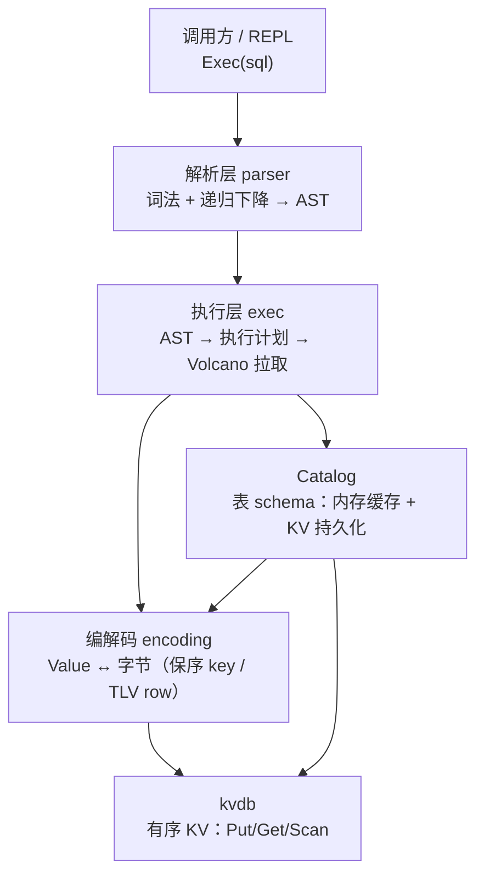

# sqldb 设计方案 —— 在 LSM-Tree KV 引擎上实现 SQL 核心功能

> 状态：已完成（2026-09-23）。M0~M6 全部落地，代码与本文一致。
> 目的：学习"SQL 层怎么长在 KV 存储上"。不是造可用数据库，也不做分布式/事务。

---

## 1. 目标与范围

**一句话**：把 `github.com/xiatianliang1024gm/kvdb`（单机 LSM-Tree KV 引擎）当作唯一存储原语，
在其上实现一个嵌入式 SQL 引擎 `sqldb`，覆盖 SQL 的核心子集。

### 范围内（In Scope）

| 能力 | 说明 |
|---|---|
| DDL | `CREATE TABLE` / `DROP TABLE`（含 IF [NOT] EXISTS） |
| DML | `INSERT`（多行）、`UPDATE`、`DELETE` |
| 查询 | `SELECT`：投影、别名、`WHERE`、`ORDER BY`、`LIMIT/OFFSET`、`DISTINCT` |
| 聚合 | `COUNT(*)`、`COUNT(col)`、`SUM/AVG/MIN/MAX` + `GROUP BY` + `HAVING` |
| 连接 | `INNER JOIN ... ON`（嵌套循环实现） |
| 表达式 | 比较、四则运算、`AND/OR/NOT`、`IS [NOT] NULL`、`IN`、`BETWEEN`、`LIKE` |
| 类型 | `INT / FLOAT / TEXT / BOOL` + `NULL`，`NOT NULL` 约束，主键约束 |
| 主键 | 单列主键（INT/FLOAT/TEXT/BOOL）；无主键表自动补隐藏 `rowid` |
| 索引 | `CREATE [UNIQUE] INDEX` / `DROP INDEX`：单列二级索引；查询自动选择（M6） |

### 范围外（Out of Scope，写死边界）

- **事务与隔离级别**：单条语句原子（靠 kvdb 的 WriteBatch），语句之间没有一致性快照。
- **多表外键、CHECK 约束**。
- **二级索引**：只有主键一个有序入口。这是刻意的——二级索引是"SQL on KV"的第二课，
  第一课先把主键路径走通。
- **LEFT/RIGHT JOIN、子查询、视图、窗口函数、CTE**。
- **并发 DDL**：catalog 有锁但按"单写者、多读者"假设设计。
- **文本编码校验、字符集排序规则（collation）**：TEXT 一律按字节序。

### 对 kvdb 的依赖面（调用方承诺）

只依赖 kvdb 的这五个原语，多一个都不用：

1. `Put / Delete / Write(batch)` —— 写入，batch 原子生效；
2. `Get` —— 主键点查（`ErrNotFound` 语义）；
3. `NewIterator` —— 有序范围扫描（半开区间 `[Lower, Upper)`、前缀扫描）；
4. `GetSnapshot` —— 暂不使用（事务的入口之一，留到以后）；
5. `Open / Close`。

**判断标准**：如果某个功能必须绕过这五个原语才能实现，说明设计错了层次。

---

## 2. 总体架构

四层，自上而下单向依赖。每一层对上层只暴露一个入口函数：



- **parser**：不认识 catalog，不认识存储。产出的 AST 是纯语法结构。
- **exec**：把 AST 绑定到 catalog（名字 → 列偏移），生成计划树，Volcano 迭代器逐行拉取。
- **encoding**：唯一知道"字节怎么摆"的层。执行器和 catalog 都不碰编码细节。
- **catalog**：唯一知道"有哪些表"的层，持久化进 KV 的 meta 前缀。

这个分层对应的检验问题：**能不能不看其他层的代码就给某一层写单测？**
parser 可以（AST 断言）、encoding 可以（字节断言）、exec 勉强可以（需要 catalog 桩）、
顶层只能端到端。测试计划按这个边界组织。

---

## 3. 键空间布局：一个 KV 里装下整个数据库

数据库 = 一个 kvdb 目录。全部数据（元数据 + 表数据）共享一个键空间，用前缀分三个区域：

```
键空间
├── meta 区      "m" | ...        表 schema、ID 分配计数器、rowid 计数器
└── data 区      "d" | ...        表行数据
```

具体键格式：

| 内容 | 键 | 值 |
|---|---|---|
| 表 schema | `m` `\x00` `schema:` `<表名>` | JSON（表ID、列定义、主键位） |
| 索引 schema | `m` `\x00` `index:` `<索引名>` | JSON（索引名、表名、列名、唯一位）（M6） |
| 下一个表 ID | `m` `\x00` `nextid` | 8 字节大端 uint64 |
| 表 rowid 计数器 | `m` `\x00` `rowseq:` `<表ID>` | 8 字节大端 uint64 |
| 一行数据 | `d` `\x00` `<表ID 8B 大端>` `r` `<保序主键编码>` | TLV 行编码 |
| 一条索引条目 | `d` `\x00` `<表ID 8B 大端>` `i` `<索引名>` `\x00` `<保序索引列编码>` `<保序主键编码>` | 空（M6） |

**为什么用 `\x00` 做区分隔符、用定长表 ID 而不是表名做前缀**：

- 表名长度可变，`dtab1` 和 `dtab10` 会前缀撞车；8 字节定长 ID 没有这个问题。
- ID 从 `nextid` 单调分配，Catalog 负责名字 ↔ ID 映射。
- 删表即删区间：`DROP TABLE` 用 kvdb 的范围扫描逐键删 `[d\x00<表ID>... 前缀全区间)`。

**data 键的结构拆开看**：

```
d  \x00  [tableID: 8B]  r  [PK保序编码]
└区┘└──┘└────固定头────┘└标记┘└─────行定位─────┘
```

- 一张表的所有行落在一个连续的键区间里，前缀 `d\x00<tableID>r`；
- 区间内按**主键的 SQL 值序**排列（这是保序编码的功劳，见 §4）；
- `r` / `i` 这两个单字节标记是同表之下的两个命名空间：`r` 放行数据，
  `i` 放二级索引条目（M6 起使用）。一张表的行与其全部索引条目共享
  `d\x00<tableID>` 前缀——DROP TABLE 一次范围清理就能带走全部。

**如果反过来会怎样**：把表名放前缀里——表重命名就要改写全部行的键；
把行数据哈希打散而不是按主键排——范围查询 `WHERE id > 10` 就退化成全表捞回内存过滤。

---

## 4. 保序编码（整个设计里最重要的一节）

### 4.1 问题

SQL 语义要"按值序"，KV 只给"按字节序"。两者必须手工对齐，靠的就是主键的保序编码：

> 对任意两个非 NULL 主键值 a、b：`bytes(encode(a)) < bytes(encode(b))` 当且仅当 `a < b`（SQL 语义）。

三条铁律：**保序、可逆、前缀无歧义**（任意两个不同值的编码互不为前缀）。
前缀无歧义是范围扫描的正确性前提——如果 `encode("ab")` 是 `encode("abc")` 的前缀，
seek 到 `ab` 时扫描可能误入下一行。

### 4.2 方案：标签字节 + 类型变换

每个主键编码 = 1 字节类型标签 + 类型特定载荷：

| 类型 | 标签 | 载荷 | 保序手段 |
|---|---|---|---|
| NULL | `0x00` | （空） | ——（主键禁 NULL，此标签仅防御） |
| INT | `0x01` | 8B | 大端 + **符号位翻转**：`uint64(v) ^ (1<<63)`，负数补码高位变 0，落到正数前面 |
| FLOAT | `0x02` | 8B | IEEE754 位模式修正：负数按位取反、非负数翻符号位；顺带解决 `-0.0`/`0.0` 位模式不同值相同的问题 |
| TEXT | `0x03` | 字节串 + `0x00 0x00` 结尾 | **0x00 转义**：内容中的 `0x00` 写作 `0x00 0xFF`；结尾 `0x00 0x00` 严格大于任何转义序列 |
| BOOL | `0x04` | 1B（`0x00`/`0x01`） | 平凡 |

- 标签字节本身有序（`0x00 < 0x01 < ...`），跨类型排序有确定结果，尽管 SQL 不允许跨族比较。
- TEXT 不允许直接接载荷——内容里可能有 `0x00`，与"下一个字段的标签"产生歧义，
  转义方案同时解决保序和前缀无歧义。

**为什么不用现成方案**（RocksDB 的 user-key timestamp、CockroachDB 的
`encoding.EncodeVarintAscending`）：那些是工程优化（变长省空间），这里是教学——
定长 8 字节 + 标签一眼能看懂，代价（TEXT 键略长、INT 键 9 字节）在单机学习项目里无关紧要。

**如果反过来会怎样**：主键编码不保序（比如用 gob/JSON 序列化），`WHERE id >= 100`
就无法转成一次 seek，所有条件查询退化为全表扫描 + 内存过滤——等于花钱买了 LSM 的有序性又扔掉。

### 4.3 行值编码：不需要保序，只需要可逆

行的物理位置完全由主键决定，value 编码只求紧凑和对称：

```
每个列值 = null标记(1B) | 载荷
  0x00                    （无载荷，后面列继续）
  0x01 | 载荷
载荷：INT/FLOAT 定长 8B 大端；TEXT = uvarint 长度 + 字节；BOOL = 1B
多列按 schema 顺序首尾相接，无分隔符 —— 解码靠 schema
```

**行存（这一版）vs 列存**：行存对"KV 上做 SQL"是最短路径——一行一个 KV 条目，
写放大天然小（LSM 友好）。列存要按列拆键、按列聚簇，读一行要 N 次 seek，在 LSM 上
还会放大写放大。学习项目选行存，文档里把列存的取舍写清楚即可。

**TLV 里不带类型**：解码需要传入 schema（列类型序列）。自描述格式（每值带类型）
每行多 ~5% 元数据开销，而 schema 变更在"无 ALTER TABLE"的前提下不可能错位。值。

### 4.4 NULL 的位置语义

- 主键禁 NULL（建表时声明 PRIMARY KEY 的列自动 NOT NULL）；
- 行内 NULL 用 null 标记位表达，不占载荷空间；
- 排序时 NULL 排最前（`ORDER BY` 的实现统一这个约定，和 PostgreSQL 的 `NULLS FIRST` 默认 ASC 一致）；
- 比较时 NULL 传染：`NULL = 1`、`NULL < 1`、`NULL AND true` 均为 NULL（三值逻辑），
  WHERE 子句里 NULL 视为不通过。这是解析器/执行器共享的语义，集中在 types 包实现。

---

## 5. Catalog：schema 也存在 KV 里

**决定：catalog 不是独立文件，就是同一个 KV 键空间的 meta 区。**

理由：
1. **崩溃一致性免费**：schema 和数据同在一个 WAL 的保护下，改 schema（建/删表）
   和任何数据写入的崩溃恢复语义完全一致，不需要第二个恢复机制；
2. **部署简单**：数据库 = 一个目录，拷走即迁移，没有伴随文件；
3. **为将来铺路**：真正的数据库（MySQL 的 frm、SQLite 的 sqlite_master 表）本质上
   也是"元数据本身是一张表"。我们的 meta 区就是手工版的 `sqlite_master`。

内存态：`map[表名]*Table` + `RWMutex`。打开数据库时全量加载（表数量小，扫描 meta 前缀即可），
之后读走内存、写同时落 KV 和内存。

schema 用 JSON 存：表数量级小、变更频率极低，可读性 > 紧凑性。`nextid` / `rowseq`
计数器用 8 字节大端（高频小写入，JSON 反而绕）。索引定义（M6）同样走 JSON、
同样住在 meta 区，按**索引名**平铺（名字全局唯一，SQLite 风格）——加载时一次
前缀扫描全部拿回，并校验引用的表与列仍然存在（防止手工改动 meta 造成悬空引用）。

**隐式 rowid**：无主键表自动加隐藏列 `rowid INT`，作为主键（值来自 `rowseq` 计数器）。
这样**执行器永远面对"每张表都有主键"**这一个世界，Scan 的范围下推逻辑只有一套。
代价是无法阻止用户自己建名叫 `rowid` 的列——建表时检查并报错。

**DROP TABLE**：先删每张索引的全部条目（`i` 区范围扫描、分批，每批 ≤1000 行），
再删全部行键（同样分批），最后单独一批删 schema + 索引 schema + 计数器。
顺序刻意是"索引条目 → 行 → meta"：回表读不到行的中间态只出现在
"条目删了一半、行还在"的方向，查询走索引最多多读到几行即将消失的行
（无事务本就无隔离，无害）；反过来"行没了条目还在"会让回表撞 `ErrNotFound`。

---

## 6. 解析器：手写递归下降

**决定：不引第三方 SQL parser，手写词法 + 递归下降。**

理由：这是学习项目的核心目的之一——SQL 字符串怎么变成树。手写一遍胜过读十篇博客。
代价是 SQL 语法覆盖有上限，但 §1 的范围内子集是标准 LL 语法，没有左递归难点
（表达式用优先级爬升法 precedence climbing 解决）。

组成：
- **token.go**：关键字表（大小写不敏感）、标识符、数字（int/float）、字符串
  （单引号、`''` 转义）、运算符、标点；
- **parser.go**：`Parse(sql) (Stmt, error)`，解析完允许一个 `;`，多余 token 报错；
- **ast.go**：语句与表达式节点。表达式节点：

```
Literal(value) | ColumnRef(table?, name) | UnaryExpr(op, x) | BinaryExpr(op, l, r)
IsNullExpr(x, not) | InExpr(x, list, not) | BetweenExpr(x, lo, hi, not) | LikeExpr(x, pattern, not)
FuncExpr(name, args | star)        -- 仅聚合函数：COUNT/SUM/AVG/MIN/MAX
```

- **LIKE 实现**：`%` / `_` 翻译成正则（其余字符转义），编译一次缓存于计划内。
- **三值逻辑在语义层不做进 parser**：parser 只产 AST，NULL 传染规则在 exec 的
  表达式求值器里实现（parser 侧无法知道值）。

- **实现时明确的三条约定**（M1 落地时定的，写在这里以免以后被当成疏忽）：
  1. 表达式节点多一个 `StarExpr(table?)`，表示 `SELECT *` / `t.*`；
     `COUNT(*)` 走 `FuncExpr` 的 star，两者不是一回事。
  2. 类型名（`INT`/`TEXT`/...）**不**进保留字表 —— 它们只在列定义那个位置有意义，
     否则 `CREATE TABLE t (text TEXT)` 会被误判成语法错误。
  3. `LIMIT` / `OFFSET` 顺序不限（SQL 标准与各家实现不一致），各自最多出现一次；
     `SELECT` 必须带 `FROM`（本版本没有"无表查询"的执行路径）。

---

## 7. 执行器：Volcano 拉取模型

### 7.1 为什么是 Volcano

每个节点实现 `Next() (*Row, error)`，父节点向子节点逐行拉取。它不是最快的模型
（向量化、编译执行都比它快），但它是**最容易看清数据流的模型**，且教科书标准。
学习项目选它，DESIGN 里记录向量化/编译执行的差异即可。

### 7.2 节点集

```
Scan      表扫描：kvdb 迭代器按前缀顺序读行 → 解码 → []Value
Filter    谓词过滤（三值逻辑：NULL 不通过）
Project   表达式求值 + 列重排（SELECT 列表）
Sort      内存物化 + 排序（NULL 最前；多键、ASC/DESC）
Limit     OFFSET + LIMIT 截断
HashAgg   GROUP BY 哈希聚合 / 无 GROUP BY 时单组（空输入也产一行，COUNT(*)=0 语义）
NLJoin    INNER JOIN 嵌套循环：外表逐行 × 内表全扫（内表缓存物化）
```

### 7.3 下推：主键优先，二级索引次之（M6 扩展）

`WHERE` 拆成合取范式后，凡是 `pk = c / pk > c / pk >= c / pk < c / pk <= c`
（c 为字面量）的谓词，直接折算成 Scan 的 `[LowerBound, UpperBound)`：

- `=` → 单点；`>` → 下界开；`>=` → 下界闭；`<` → 上界；`<=` → 上界含（编码后 +1 微调）。
- 剩余谓词留在 Scan 之上的 Filter 里求值。

M6 起增加第二选择：某张表**没有**可用的主键下推时，再看它的合取项里有没有
落在某个二级索引列上的同形谓词（同样的五运算符、字面量类型与列类型完全一致）。
有就把这张表的 Scan 换成 IndexScan —— 索引条目按 `索引列编码 + 主键编码` 有序，
区间几何与主键下推完全同款，只是扫完条目还要回表。每张表最多选一个索引，
等值优先于范围；命中索引列的多个合取项折进同一个区间（与主键区间同款合并）。

**选择顺序为什么是主键优先**：主键扫描直接产出行，索引扫描多一次回表点查；
只有主键帮不上忙时索引才值得。同一列既不是主键也没有索引、或类型不匹配
（INT 列配 FLOAT 字面量这类数值混比）的谓词，全部留在 Filter 里由求值器处理。

**为什么只做这三种**：主键是免费的有序入口；二级索引是花了写放大买来的
第二个有序入口。剩下的每个优化（覆盖索引、多列索引、Join 顺序）都是在这条
基线上叠加的。

**如果反过来会怎样**：不做任何下推，`WHERE id = 5` 也是全表扫。单测里放
"扫描行数"和"索引条目数"两个计数器，让下推前后差异可观测。

### 7.4 排序与聚合：内存物化

`Sort` 和 `HashAgg` 都把子节点结果整个物化进内存。单机学习项目可接受；
真实的溢写（spill to disk）不在范围内，文档记录何时需要它。

**聚合类型检查从宽**：`SUM(text_col)` 在执行到第一个值时报错，而不是计划期做类型推导——
计划期类型系统是下一个学习阶段的事，先保证语义正确。

**HAVING**：在 HashAgg 之上套 Filter，求值环境是"组内聚合值 + 分组键"。

### 7.5 二级索引（M6）

**条目格式（统一，唯一/非唯一同构）**：

```
d  \x00  [tableID: 8B]  i  [索引名] \x00  [索引列保序编码]  [主键保序编码]     值 = 空
└区┘└──┘└────固定头────┘└标记┘└─区域─┘└────定位────────└────行定位────┘
```

- **索引名是区域分隔**：一张表可以有多张索引，条目混在同一个 i 前缀下，
  键本身不含"属于哪张索引"。不隔开的话，DROP INDEX 无法只删自己的条目，
  同类型列的两张索引还会在区间扫描里互相串行。用名字而不是数字 ID：
  索引名是标识符、词法上不可能含 0x00，单字节终止符无歧义，省掉一个
  ID 分配计数器（取舍表 #17）。
- 主键编码接在索引列编码之后：一个作用是给非唯一索引区分同值行（天然允许
  重复），另一个作用是**回表的行定位器**——不用额外存行键，拆尾部就是。
- **区间几何与主键下推有一处关键不同**：条目在 enc(v) 之后还拖着主键
  编码，所以"索引值等于 v"的排他上界是 enc(v) 的**后继**（末字节 +1 进位
  截断）而不是 enc(v)+0x00 —— 后者比任何一个同值条目都小，区间恒为空
  （M6 实现时踩过、被可观测性测试当场抓住的真 bug）。行键的 `pk = c`
  不受影响：完整行键恰好等于前缀本身，[k, k+0x00) 恒含 k。
- **唯一与非唯一同构**：唯一性不靠特殊格式（比如"唯一索引把主键放 value"），
  靠"对索引值前缀做 seek 查重"——读到第一个条目拆出主键，不等于自己就是冲突。
  统一格式让回表、区间折算、维护代码只有一套，代价是唯一查重要拆一次键。

**NULL 语义**：NULL 行也进索引（标签 `0x00` 本来就是编码表的一员），
但**唯一约束豁免 NULL**——SQL 标准语义，多个 NULL 不算重复。查询路径上
`col IS NULL` 不参与下推（它不是比较谓词），走全表扫描，正确性不受影响。

**回填（CREATE INDEX 在非空表上）**：按主键序扫全表 → 逐行编条目 → 分批
Put（每批 ≤1000 条）→ **索引 schema 的 meta 键最后一批写**。顺序的含义：
中途崩溃最坏留下"没有 meta 的孤儿条目"——它们永远不会被读到（计划选择只认
meta），重跑 CREATE INDEX 会原键重写（幂等），DROP TABLE 会按表前缀带走。
若倒过来先写 meta，崩溃后查询就会相信一个只建了一半的索引。唯一索引回填
逐行查重，发现冲突回滚已写条目、不落 meta，整条语句一行索引不剩。

**可观测性**：Plan 暴露两个计数器——`RowsScanned`（数据区读到的行数）与
`IndexEntriesScanned`（索引条目数 + 回表点查数）。`WHERE email = 'x'` 在
有索引时应看到前者为 0、后者为命中条数；没索引时前者为全表行数。

### 7.5 M4 落地时定下的约定（代码即此语义，避免以后被当成疏忽）

1. **ORDER BY 的求值环境**：键在 Sort 所在层的行上求值 —— 非聚合查询在
   基表（连接）行上、聚合查询在 HashAgg 的伪行上，Sort 永远位于 Project
   之下。别名 / 输出列名 / 序号（`ORDER BY 2`）在计划期先翻译成对应的
   SELECT 表达式再绑定；翻译不到的按自由表达式处理。
2. **NULL 排序**：NULL 视为最小值 —— ASC 排最前、DESC 排最后
   （与 PostgreSQL 的默认 NULLS FIRST / NULLS LAST 一致）。排序用稳定排序，
   等键行保持扫描序。
3. **DISTINCT 约束排序键**：SELECT DISTINCT 下 ORDER BY 必须能对应到输出列
   （别名 / 序号 / 与某个输出项描述一致的表达式），否则报错 —— 去重之后
   基表行已消失，非输出列的键无处求值，这与 SQL 标准的要求一致。
   DistinctNode 保留首次出现顺序，去重不会打乱排序结果。
4. **DISTINCT / 分组的值身份**：按 Kind + 值规范化 —— NULL 与 NULL 同身份
   （分组、去重语义）；±0.0 归一化成同一身份（与 Compare 判等一致）；
   INT 5 与 FLOAT 5.0 是不同身份（不同 Kind 不进同一等价类，与 Compare
   拒绝跨族比较的立场一致）。
5. **聚合语义**：COUNT(*) 数行、不碰列；其余聚合跳过 NULL。空组（空输入
   或全 NULL）：COUNT = 0，SUM/AVG/MIN/MAX = NULL。SUM 的 INT 输入保持 INT、
   见过 FLOAT 才升格；AVG 永远 FLOAT。SUM/AVG 遇到非数值输入在第一个
   非 NULL 值上报错（§7.4"从宽"的方向）。只有 COUNT(*) 允许 star。
6. **非聚合列必须被 GROUP BY 覆盖**：SELECT/HAVING/ORDER BY 里聚合之外的
   列引用，必须被某个 GROUP BY 表达式引用到（列偏移级判定）—— 这是
   "该列在组内是常量"的充要条件。不做主键函数依赖推导（`GROUP BY id`
   时选 name 依然报错）。GROUP BY 表达式里不允许聚合。
7. **聚合查询的伪行**：HashAgg 每组输出"组内第一行的全部基表列 ++
   各聚合最终值"，输出 / HAVING / ORDER BY 都绑定在伪行上求值；同一个
   聚合写多处（SELECT 和 ORDER BY 各一遍 COUNT(*)）按表达式去重，只算一份。
8. **JOIN**：左深嵌套循环，内表整表物化缓存。ON 在连接循环里逐行求值
   （NULL 不匹配、非 Bool 报错），**不参与下推** —— WHERE 的主键下推
   按谓词所属的表各自动作。ON 的绑定作用域只含已出现的表（引用后面
   才 JOIN 的表是错的）。列作用域 = 各表（别名优先）按 FROM 顺序拼接，
   未限定列命中多张表报 ambiguous。
9. **LIMIT/OFFSET**：非负整数（解析器保证），OFFSET 先跳过。带 GROUP BY
   的空输入是零行；无 GROUP BY 的空输入是单组一行（见 §7.2）。

---

## 8. 写路径

### INSERT

1. 定位列（缺省列补默认值 NULL / rowid）；
2. NOT NULL 约束检查、类型检查（执行期）；
3. 主键编码 → 拼行键；
4. `db.Get(行键)` 查重 → 冲突报 `duplicate primary key`；
5. 多行 INSERT 编进**一个 WriteBatch**，一次 `Write` 提交（原子）；
6. rowid 表先从计数器分配 ID，计数器更新进同一个 batch。

**读检查非原子**：步骤 4 的查重和步骤 5 的提交之间没有隔离（无事务）。
并发下理论上可产生重复主键。单机嵌入式、单写者假设下可接受，文档如实记录
——这是"没有事务"的具体代价之一，不是疏忽。

**M3 落地时定下的四条约定**（代码即此语义，避免以后被当成疏忽）：

1. **类型检查方向**：INT 字面量进 FLOAT 列允许（升格，无损）；FLOAT 进 INT
   拒绝（隐式截断是坑）；其余跨族一律拒绝。这是取舍表 #11"执行期从宽"的
   具体方向 —— 从宽指的是"计划期不做推导"，不是"什么都收"。
2. **NOT NULL 检查对整行生效**：省略的列默认 NULL，同样过不了检查 ——
   "没写这一列"和"显式写 NULL"在约束眼里是一回事。
3. **隐藏 rowid 不可显式插入**：列清单里出现 `rowid` 直接报错。它是系统
   分配的，用户给值会和计数器打架；查询里引用 rowid 合法（它就是主键）。
4. **失败不落行**：约束检查、主键查重全部发生在 `Write` 之前，任何一行
   失败整条语句返回错误、一行不落。多行编一个 batch（行数超过 kvdb 的
   MaxBatchBytes 会报错，不隐式拆批 —— 拆批就丢了语句级原子性）。

### UPDATE

- 主键列**不允许 UPDATE**（直接报错）：改主键 = 删旧行 + 插新行，把它留给
  `DELETE + INSERT`，语义更诚实；
- 流程：下推主键范围 → 扫描命中的行 → 逐行求值 SET → 编进一个 WriteBatch
  （Put 新值，键不变）→ 返回受影响行数。

### DELETE

- 同上：扫描（享受范围下推）→ 命中行进 batch（Delete）→ 返回行数。
- `DELETE` 不带 WHERE = 全表删，同样走扫描路径（kvdb 的 DeleteRange 不暴露在
  五原语里，且我们需要逐行判断谓词；全删优化留作将来）。

### 索引维护（M6）

写路径的三条语句都背着索引走，且全部编进**同一个** WriteBatch——行与它的
索引条目必须同生同死，这是"条目是行的派生数据"的底线：

- **INSERT**：每行对表的每张索引 Put 一条条目；唯一索引先查重（对索引值前缀
  seek，见 §7.5）。
- **UPDATE**：SET 只改到某索引列时才动那张索引——删旧条目、Put 新条目、
  唯一查重。查重的比较对象是"条目里的主键 ≠ 本行主键"，同一行同值改写
  天然放行。
- **DELETE**：每行每索引 Delete 一条条目。
- **同批查重**：多行语句内部的重复（两条 INSERT 同主键 / 同唯一索引值）
  靠 Get 发现不了——它们都没提交。用一张"本语句已写键"的集合补上这个洞，
  主键查重与唯一索引查重共用（M6 顺手修掉 M3 遗留的主键同批漏检）。
- 查重与提交之间没有隔离的老结论不变（单写者假设下不会发生）。
- **UPDATE/DELETE 的写扫描不做索引下推**：读哪几行仍然只有主键一条快路。
  写路径本就要物化整批，索引省下的扫描量收益有限，先不让计划选择长出第二个
  分叉——记录为将来工作。

---

## 9. 顶层 API

```go
db, _ := sqldb.Open("mydata")            // 内部 Open 一个 kvdb
res, err := db.Exec("SELECT id, name FROM users WHERE age > 18 ORDER BY id LIMIT 10")

type Result struct {
    Columns     []string        // SELECT 列名（含别名）
    Rows        [][]types.Value // 行数据（仅查询）
    RowsAffected int64          // INSERT/UPDATE/DELETE 受影响行数
}
```

- 一个 `Exec` 通吃 DDL/DML/查询（Result 里按语句类型填充不同字段），REPL 好用优先；
- `REPLACE INTO` / `UPSERT` 不做，主键冲突就是错。

---

## 10. 关键取舍总表（延续 kvdb DESIGN 附录 D 的风格）

| # | 决策 | 选择 | 反面方案 | 理由 |
|---|---|---|---|---|
| 1 | 主键编码 | 保序（标签+变换） | 哈希/JSON 序列化 | 范围下推的正确性前提；哈希只能点查 |
| 2 | 行格式 | 行存 TLV | 列存 | 最短路径；LSM 写放大友好；列存另开课题 |
| 3 | Catalog 位置 | 同一 KV 的 meta 区 | 独立元数据文件 | 崩溃一致性免费；一个目录即整库 |
| 4 | 无主键表 | 隐藏 rowid 主键 | 执行器支持"无序堆" | 执行器只面对一种表；代价是 scan 永远有序 |
| 5 | 解析器 | 手写递归下降 | participle / ANTLR | 学习目的；子集语法无左递归难点 |
| 6 | 执行模型 | Volcano | 向量化 / 编译执行 | 数据流最清晰，教科书标准；性能非目标 |
| 7 | 下推 | 仅主键范围 | 无下推 / 全下推 | 唯一有序入口；可观测（扫描计数器） |
| 8 | 语句原子性 | WriteBatch | 事务 + 快照 | 用户明确排除事务；kvdb 原语够用 |
| 9 | INSERT 查重 | 先 Get 再写 | 靠扫描发现重复 | O(log) 点查；代价：检查与提交间无隔离（如实记录） |
| 10 | 主键 UPDATE | 禁止 | 删+插自动展开 | 语义诚实；避免隐藏的双写 |
| 11 | 类型检查 | 执行期从宽 | 计划期类型推导 | 先保语义正确；类型系统是下一课 |
| 12 | schema 存储 | JSON | 自定义二进制 | 变更频率极低，可读性优先 |
| 13 | 索引条目格式 | 唯一/非唯一同构（PK 接在键尾） | 唯一索引把 PK 放 value | 回表、区间折算、维护只有一套代码；查重多拆一次键 |
| 14 | 唯一约束与 NULL | NULL 豁免（但仍进索引） | NULL 也算冲突 | SQL 标准语义；IS NULL 不下推走全表，正确性不受影响 |
| 15 | 回填顺序 | 条目分批先写，meta 最后写 | 先写 meta 再回填 | 崩溃留孤儿条目（不可见、幂等、DROP 带走），不能留半个"可信"索引 |
| 16 | 写路径与索引 | 不做索引下推，只维护 | UPDATE/DELETE 也走索引 | 写路径本就整批物化；少一个计划分叉 |
| 17 | 索引条目区域标识 | 索引名 + 0x00 终止符 | 数字索引 ID + 计数器 | 标识符不含 0x00，终止符无歧义；免一套 ID 分配，代价是键略长 |

---

## 11. 里程碑（对齐 kvdb 的 M0~M5 节奏）

| 阶段 | 内容 | 验收 |
|---|---|---|
| M0 骨架 | go.mod / types / encoding / catalog | 编解码单测：保序性质 + 往返；catalog 建表重开可读 |
| M1 解析器 | lexer + parser + AST | 解析单测：范围内全部语句与表达式；错误定位报行列号 |
| M2 查询主链 | Scan/Filter/Project + Exec 串联 | `SELECT * FROM t WHERE pk > 10`，范围下推可观测 |
| M3 写路径 | INSERT/UPDATE/DELETE + 约束 | 主键冲突、NOT NULL、受影响行数、重开不丢 |
| M4 查询全量 | Sort/HashAgg/Limit/NLJoin/DISTINCT | 聚合、GROUP BY/HAVING、JOIN、NULL 三值逻辑单测 |
| M5 收尾 | REPL + 文档 + 全量测试 | 手工 REPL 会话记录进 README；`go test ./...` 全绿 |
| M6 二级索引 | CREATE/DROP INDEX + 条目编码 + 写路径维护 + IndexScan + 计划选择 | 下推可观测（数据行 0 / 条目数）；唯一约束（含 NULL 豁免、同批）；回填与重开持久 |

依赖方向：M0 无依赖；M1 无依赖（可与 M0 并行）；M2 依赖 M0+M1；M3 可与 M2 并行；
M4 依赖 M2；M5 收尾；M6 依赖 M0（编码）+ M3（写路径）+ M4（计划构建）。

---

## 12. 当前进度

- **M0 完成（2026-09-23）**：
  - go.mod（module + replace 指向 `../kvdb`）已就位；
  - `internal/types/value.go`：五种 Kind、Value、Compare（三值逻辑的比较原语）；
  - `internal/encoding/key.go` / `row.go` / `rowkey.go`：保序主键编码、TLV 行编码、
    行键布局（`d\x00<tableID>r`）。M0 单测补齐时修了两处草稿缺陷：
    FLOAT 编码对 `-0.0` 会编码成全 0 并在解码时还原出 NaN（现按 §4.2 的承诺把
    ±0.0 归一化成同一编码）；`row.go` 引用了未定义的浮点转换帮助函数（改回标准库）；
  - `internal/catalog/catalog.go`：内存 map + KV meta 区持久化。建表把
    nextid 推进、schema JSON、rowseq 清零编进同一个 WriteBatch（§5 的
    "崩溃一致性免费"落地）；无主键表补隐藏 rowid 并拒绝用户建同名列；
    DROP TABLE 先分批删数据（每批 ≤1000 行）、最后单独一批删 schema + 计数器，
    不出现"schema 没了行还在"的幽灵数据；
  - 单测全绿（`go test ./...`）：保序三铁律（同类型保序 / 往返 / TEXT 前缀无歧义）、
    ±0.0 同编码、行编码往返 + 截断识别、建表重开可读、表 ID 重开后续接、
    DROP 2500 行分批清理。
- **M1 完成（2026-09-23）**：解析器（`internal/parser`，不依赖 M0 之外的任何包）。
  - `token.go`：关键字表（大小写不敏感、保留原文）、标识符（unicode 判断，中文列名可用）、
    数字（int/float/科学计数法，词法层就定好 `types.Kind`）、字符串（单引号 + `''` 转义）、
    运算符（含 `<= >= <> !=`）；位置按 rune 计列，中文不会让列号翻倍；
  - `ast.go`：语句（CREATE/DROP/INSERT/UPDATE/DELETE/SELECT）+ 表达式
    （Literal/ColumnRef/Star/Unary/Binary/IsNull/In/Between/Like/Func）。纯语法结构：
    没有列偏移、没有类型推导，主键列隐式 NOT NULL 留给 catalog；
  - `parser.go`：`Parse(sql)` 单语句入口（允许一个尾分号，多余 token 报错），
    表达式用优先级爬升（§6）。两处值得记的语义：`NOT` 低于比较，所以
    `NOT a = b` 是 `NOT (a = b)`；`IS/IN/BETWEEN/LIKE` 放在爬升循环里而不是跟在
    primary 后面，所以 `a + b IS NULL` 是 `(a + b) IS NULL`；
  - 单测（parser 包 85 个用例，全绿）：范围内全部语句、`*`/`t.*`/别名（带不带 AS）、
    JOIN、GROUP BY/HAVING、ORDER BY（ASC/DESC）、LIMIT/OFFSET（两种顺序）、
    优先级与结合性 30 例、错误 19 例（含跨行列号与 `*ParseError` 结构化断言）。
- **M2 完成（2026-09-23）**：查询主链（`internal/exec` + 顶层 `sqldb` 包）。
  - `internal/types/logic.go`：三值逻辑原语（LogicAnd/Or/Not）——§4.4 承诺的
    "NULL 传染集中在 types 包"落地；false 是比 NULL 更强的传染源，与 PostgreSQL 一致；
  - `internal/exec/expr.go`：表达式绑定 + 求值。绑定把 AST 翻译成"列名 → 列偏移"的
    内部树，一次翻译逐行求值；LIKE 的正则在绑定期编译一次缓存于计划内（§6）。
    求值器一次性做全（比较/四则/AND/OR/NOT/IS NULL/IN/BETWEEN/LIKE），没有只做
    半个——Filter 需要完整语义，拆开只会造成"半个求值器"的中间态；
  - `internal/exec/operator.go`：Volcano 节点 Scan/Filter/Project。Scan 带着
    可观测的"扫描行数"计数器（§7.3 的验收要求）；Filter 是三值逻辑的收口点
    （NULL 不通过，非 Bool 报错）；
  - `internal/exec/select.go`：计划构建 + 主键范围下推。合取项拆平后，形如
    `pk <op> 字面量`（op ∈ {=,<,<=,>,>=}，两种书写顺序都认）折算成
    [LowerBound, UpperBound)；矛盾条件自然折出空区间。两条保守限制：
    **字面量类型必须与主键列类型完全一致**（INT 列 vs FLOAT 字面量这类数值混比
    留在 Filter 里由求值器升格——两套标签字节混进区间会错序），**!= 不下推**；
  - `sqldb.go`：顶层 Open/Exec/Result（§9），Exec 通吃 DDL/SELECT，
    INSERT/UPDATE/DELETE 给出明确的"M3 实现"提示而不是含糊报错。
  - 单测全绿（`go test ./...`），M2 验收线钉死：
    - 下推可观测：100 行的表 `WHERE id > 90` 扫 9 行，对照组非主键谓词扫 100 行；
    - 全部六种比较 + 双向书写顺序 + 矛盾条件 + 负数/TEXT/FLOAT 主键的区间正确性；
    - 三值逻辑（NULL 传染、NOT NULL）、IN/BETWEEN/LIKE（含 QuoteMeta）、
      表达式投影与别名、Filter 引用未投影列；
    - 端到端：建表 → 直写行 → 查询 → 关库重开不丢 → DROP 后查询报错。
  - M2 期间修掉的一个真 bug，值得记：**无上界的下推扫描会漏进 meta 区**。
    数据区前缀 `d\x00` 按字节序排在 meta 区 `m\x00` 之前，`WHERE id > 90`
    只有下界，读完本表的行迭代器继续前进就把 schema 的 JSON 当行解码了。
    修复：扫描上界为空时用表前缀的后继封口（与 kvdb 给 Prefix 算上界同款算法）。
    教训：共享键空间里做区间扫描，"区间必须完全落在自己的区域内"是调用方的责任，
    kvdb 不会替你挡。
- **M3 完成（2026-09-23）**：写路径（`internal/exec/write.go` + catalog 计数器接口）。
  - `catalog.NextRowIDs`：rowid 计数器的预留接口 —— 返回起始 ID 和需要编进
    同一个 WriteBatch 的计数器更新，键布局不出 catalog（§5 的"catalog 唯一
    知道 meta 区"维持不变）；计数器与行数据同批落盘，崩溃时要么一起推进
    要么一起没动，不会分配出重复 rowid；
  - `select.go` 的 WHERE 处理抽成 `pushdownWhere` 共享：SELECT 的计划构建和
    UPDATE/DELETE 的写扫描走同一条下推路径（§8 的要求）—— 否则"改哪几行"
    和"看见哪几行"会对不上；
  - `write.go` 三条路径一个骨架：定位（INSERT 点查 / UPDATE·DELETE 扫描）→
    约束检查 → 一个 WriteBatch 提交。写扫描独立成 `scanTableRows` 而不是给
    Volcano 接口凿"把键也给我"的口子 —— 写路径本来就要整批物化，并保留
    可观测的扫描行数（下推效果与 M2 同样可验证）；
  - UPDATE 禁改主键（取舍表 #10 落地）；SET 求值环境是更新前的行（
    `SET score = score + 1` 语义）；
  - 单测全绿（`go test ./...`），M3 验收线钉死：主键冲突（含多行语句中途
    冲突一行不落）、NOT NULL（显式 NULL 与省略列同样拦截）、类型检查方向、
    受影响行数、rowid 连续分配 + 显式插入拒绝、写路径下推可观测
    （`id > 90` 扫 9 行）、DELETE 的三值逻辑（NULL 不通过）、端到端
    重开不丢 —— 特别是 rowid 计数器游标在重开后接续，不回退。
- **M4 完成（2026-09-23）**：查询全量（`internal/exec` 的 aggregate.go / join.go、
  operator.go 扩充、select.go 重写）。M4 期间定下的语义约定集中在 §7.5，
  这里只记实现与验收：
  - `internal/exec/expr.go`：binder 从单表升级为多作用域（scopeEntry 列表：
    限定名 + 列偏移基址），未限定列跨表命中多个报 ambiguous；聚合绑定
    上下文（aggContext）挂在 binder 上 —— FuncExpr 在绑定期被拦截登记成
    aggSpec 并替换成伪行槽位引用，聚合写多处按表达式去重只算一份；
  - `internal/exec/aggregate.go`：HashAgg 子树物化 + 哈希分组 + 增量聚合
    （一遍扫描）；伪行 = 代表行 ++ 聚合值；GROUP BY 哈希键与 DISTINCT
    去重键共用一套值身份规范化（NULL 同组、±0.0 归一、Kind 为界）；
  - `internal/exec/join.go`：NLJoinNode —— 内表整表物化，ON 在循环内逐行
    求值；多表 JOIN 装成左深树，连接行 = 各表行按 FROM 顺序首尾相接；
  - `operator.go` 增 Sort（物化 + 稳定多键排序，NULL 视为最小）、Limit、
    Distinct；FilterNode 加 label 让 HAVING 报错有正确上下文；
  - `select.go` 重写：作用域构建 → star 展开 → WHERE 按表下推 → 扫描 +
    连接树 → 聚合判定（GROUP BY/HAVING/输出或排序项含聚合）→ 绑定 →
    Sort → Project → Distinct → Limit。主键下推从"单表一组界"升级为
    "每个作用域条目一组界"，JOIN 下各表各自动作（下推可观测性保持）；
  - `write.go` 适配新 binder / pushdownWhere 签名，写路径语义不变；
  - 单测全绿（`go test ./...`），M4 验收线钉死：聚合五函数 + 空输入
    语义（COUNT=0 / 其余 NULL）+ SUM(text) 执行期报错；GROUP BY 表达式
    与列、NULL 自成一组、HAVING 过滤、未覆盖列报错；JOIN 的三值逻辑
    （uid NULL 不匹配）、三表左深、限定 star、歧义列、ON 作用域限制、
    别名自连接；排序 NULL 先/后 + 多键 + 别名/序号/表达式键；DISTINCT
    的 NULL 合并 + 排序键约束；LIMIT/OFFSET 全分支；JOIN 下下推可观测
    （orders 侧 `id >= 12` 扫 3 行）；组合拳（JOIN+GROUP BY+HAVING+
    ORDER+LIMIT、DISTINCT+ORDER+LIMIT）。
- **M5 完成（2026-09-23）**：收尾（`cmd/sqldb` REPL + README + 全量测试）。
  - `cmd/sqldb/main.go`：REPL 主循环 —— 语句以 `;` 结尾、可跨多行（缓冲区
    单引号计数判断完整性，字符串字面量里的 `;` 不截断）；元命令
    `.tables` / `.schema [表名]` / `.help` / `.quit`；错误只报告不退出；
    stdin 非终端时同样逐行执行，README 里的会话记录就是管道喂脚本原样捕获的；
  - `cmd/sqldb/render.go`：展示层 —— 结果表格化（CJK 全角按 2 列计宽，
    中列名/中文数据不错位；NULL 原样显示与空串可见区分）、schema 反渲染成
    CREATE TABLE（隐藏 rowid 用注释标出）、`statementComplete` / `firstWord`；
  - `sqldb.go` 补两个只读接口给 REPL 元命令用：`Tables()`（全部表名，排序）
    和 `TableSchema(name)`（返回 catalog.Table 结构体而非 SQL 文本 ——
    展示成什么样是 REPL 的自由，引擎只负责事实）；
  - 展示结果按语句类型分流：SELECT 出表格，INSERT/UPDATE/DELETE 报
    受影响行数（单复数区分），DDL 报 ok —— 用首单词判断而不是 Result 字段，
    因为 Result 无法区分"DDL 成功"和"DML 影响 0 行"；
  - M5 测试钉住的验收线：`go test ./...` 全绿（6 包，含 cmd/sqldb 新增的
    表格渲染 / CJK 宽度 / 语句完整性 / REPL 管道端到端 / EOF 未闭合语句处理）、
    `go vet` / `gofmt` 干净；手工会话记录进 README（真实捕获，未编辑）。
    M5 期间修掉一个展示层真 bug：表格末行边框少写换行，导致下一行输出
    （如 `(3 rows)`）粘在 `└...┘` 后面 —— 单测的精确字符串比对抓的。

- **M6 完成（2026-09-23）**：二级索引（parser 的 INDEX/UNIQUE 关键字、
  catalog 的 `m\x00index:` meta 区、encoding 的条目键、exec 的
  index.go —— 维护/查重/回填/IndexScan、select.go 的两段式下推）。
  - 条目键 `d\x00<tableID>i<索引名>\x00<enc(列值)><enc(主键)>`（§7.5）：
    统一格式 + 名字做区域分隔，唯一/非唯一一套代码；
  - 写路径：INSERT/UPDATE/DELETE 与条目同 batch 同生同死；唯一查重
    两道关（已提交 seek + 语句内 scratch），顺带补掉 M3 的"同批两条
    INSERT 同主键"漏检；NULL 进索引但豁免唯一约束；
  - 回填：条目分批先写、meta 最后写，唯一冲突回滚已写条目（一行索引
    不剩）；DROP INDEX 先删 meta 再清自己的区域，DROP TABLE 按每张
    索引的区域 + 行前缀清理；
  - 计划选择：主键优先，主键帮不上忙的表选一个索引（等值优先），
    类型不匹配/LIKE/!= 一律留在 Filter；Plan 暴露 RowsScanned 与
    IndexEntriesScanned 两个计数器；
  - M6 期间修掉的真 bug（可观测性测试当场抓住）：等值下推套用主键的
    `enc(v)+0x00` 上界，对"条目 = enc(v) + pkEnc"的变长键是空区间
    —— 正确几何是 enc(v) 的后继（§7.5 已写明，这是区间几何的第二课）。
  - 验收线钉死：下推可观测（等值走索引 rows=0/entries=2、LIKE 全表
    100 行、类型不匹配全表、主键优先）、索引路径与全表路径结果一致
    （含范围、NULL）、唯一约束（已提交冲突、同批冲突、UPDATE 撞值、
    同值放行、NULL 豁免）、DML 维护（DELETE/UPDATE 后条目数与可见性）、
    回填（30 行补 30 条）、重开持久、DROP INDEX/TABLE 清理、IF 语义。

任何与本文档冲突的代码，以文档为准——先改文档再改代码。
